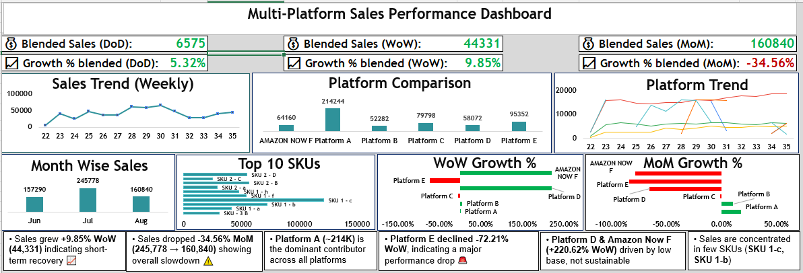

# 📊 Multi-Platform Sales Performance Analysis (Excel + Power Query)

## 📌 Overview
This project focuses on analyzing multi-platform sales data using Microsoft Excel and Power Query. The dataset was initially unstructured and required transformation before meaningful analysis could be performed.

The objective was to clean, structure, and analyze the data to uncover trends, measure growth, and identify key performance drivers across platforms and products (SKUs).

---

## ⚠️ Problem Statement
The raw dataset was not in an analysis-ready format:
- Platform-wise data was spread across multiple columns (wide format)  
- Difficult to aggregate, compare, and analyze trends  
- Not suitable for pivot tables or scalable analysis  

---

## 🔧 Data Transformation (Power Query)

To solve this, the following steps were performed:

- Unpivoted platform-wise columns into a structured (long) format  
- Standardized and cleaned data fields  
- Appended multiple datasets into a unified table  
- Prepared data for efficient analysis and visualization  

📦 **Final Clean Dataset: 4,158 rows (analysis-ready format)**  

---

## 📊 Dataset Summary
- 📅 Time Period: June 2024 – August 2024  
- 📦 Total Sales Value: **563,908**  
- 🏪 Platforms: **6 sales channels**  
- 📦 SKUs: **16 unique products**  
- 📊 Granularity: Daily SKU-level sales  

---

## 🎯 Objectives
- Analyze sales performance across platforms and SKUs  
- Measure growth using DoD, WoW, and MoM metrics  
- Identify dominant platforms and revenue-driving products  
- Detect performance trends and fluctuations  

---

## 📈 Key Metrics
- 💰 **Total Sales:** 563,908  
- 📊 **WoW Growth:** +9.85%  
- 📉 **MoM Growth:** -34.56%  
- 💰 **Blended Weekly Sales:** 44,331  

---

## 📊 Analysis Performed

### 1. Time-Based Analysis
- Monthly Sales Breakdown:
  - June: 157,290  
  - July: 245,778  
  - August: 160,840  

---

### 2. Platform Performance
- Platform A is the dominant contributor (~214K sales)  
- Significant variation observed across 6 platforms  
- High dependency on a single platform identified  

---

### 3. SKU-Level Analysis
- Only **16 SKUs**, with sales concentrated in a few top performers  
- Indicates potential risk due to product dependency  

---

### 4. Growth Analysis
- Short-term improvement: **+9.85% WoW growth**  
- Overall decline: **-34.56% MoM**  
- Highlights inconsistent performance trends  

---

## 🔍 Key Insights
- Revenue is concentrated across limited platforms and SKUs  
- Heavy reliance on Platform A introduces business risk  
- Short-term gains do not translate into sustained growth  
- Optimization required in both platform strategy and product distribution  

---

## 🛠️ Tools & Techniques
- Microsoft Excel  
- **Power Query (Data Cleaning & Transformation)** ⭐  
- Pivot Tables & Aggregations  
- Time-Series Analysis (DoD, WoW, MoM)  

---

## 📷 Dashboard Preview

---

## 🚀 Outcome
This project demonstrates a complete data workflow:
👉 Raw Data → Transformation → Analysis → Insights  

It highlights the importance of:
- Cleaning and structuring data before analysis  
- Using Excel + Power Query to handle real-world messy datasets  
- Generating actionable insights for business decision-making  

---

## 🤝 Connect
Open to opportunities in Data Analytics, Power BI, SQL, and Python roles.
